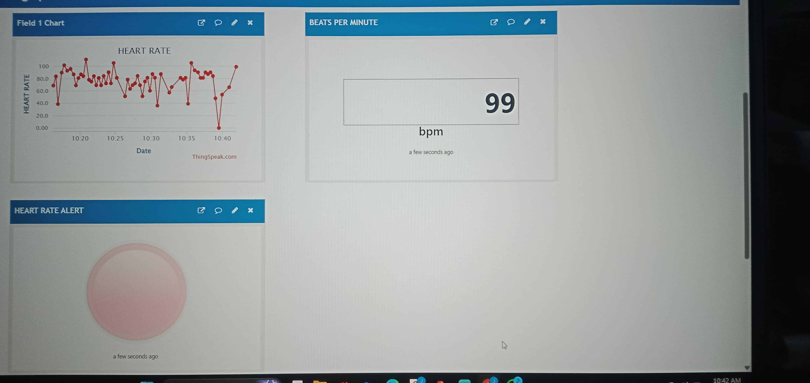
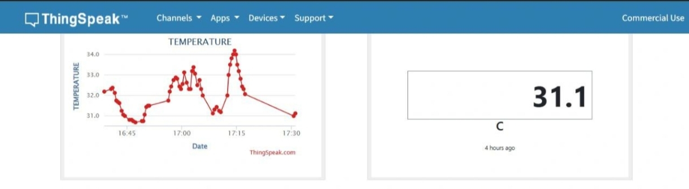
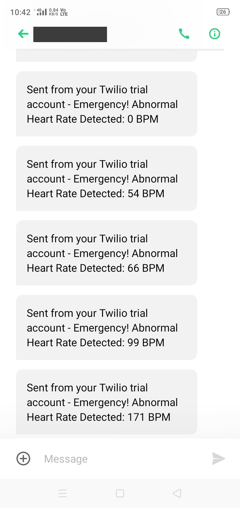
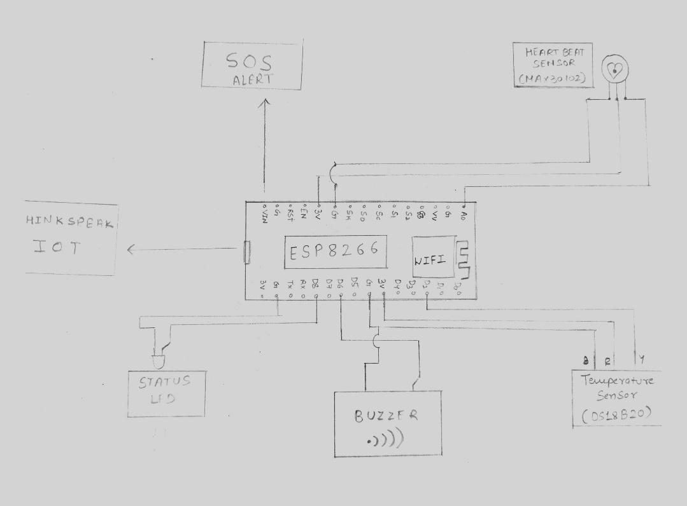

# IoT-Based Heart Rate & Temperature Monitoring System

A real-time health monitoring system built on the ESP8266 NodeMCU that measures heart rate and body temperature, logs data to the cloud, and automatically sends an emergency SMS alert when readings fall outside a safe range.

Built as a minor project by **Group 1, Department of Electrical Engineering, Shri G.S. Institute of Technology and Science.**

---

## 🩺 Overview

Continuous manual monitoring of patient vitals is difficult in hospitals, elderly care, and remote areas. This project automates that process end-to-end:

**Sensors → ESP8266 NodeMCU → ThingSpeak Cloud → Dashboard → Twilio SMS Alert**

- Heart rate and temperature are sampled in real time
- Data is pushed to a ThingSpeak channel for live visualization
- If heart rate goes below 50 or above 120 BPM, the system automatically triggers an emergency SMS alert via Twilio

---

## ⚙️ Hardware Components

| Component | Purpose |
|---|---|
| ESP8266 NodeMCU V3 | Microcontroller + WiFi |
| Analog Pulse/Heartbeat Sensor | Heart rate (BPM) measurement |
| DS18B20 Temperature Sensor | Body temperature (fever detection) |
| SSD1306 OLED Display | Live on-device readout |
| Buzzer | Audible emergency alert |
| Status LED | System/heartbeat indicator |
| 4.7kΩ Resistor | Pull-up for DS18B20 |

## 💻 Software / Services

- **Arduino IDE** — code development and upload
- **ThingSpeak** — cloud data logging and real-time visualization
- **Twilio API** — emergency SMS alerts

---

## 📊 How It Works

1. **Data Collection** — Pulse sensor and DS18B20 continuously sample vitals.
2. **Peak Detection** — Heartbeats are detected using a *dynamic, self-adjusting threshold* (rise relative to the previous reading), rather than a fixed ADC window, so it adapts to sensor placement, lighting, and skin tone.
3. **BPM Calculation** — Beats are counted over a 20-second window and scaled to beats-per-minute.
4. **Cloud Logging** — Readings are pushed to a ThingSpeak channel every cycle.
5. **Emergency Alert** — If BPM is outside the 50–120 safe range, an SMS is sent via Twilio with the abnormal reading.

## 📈 Dashboard

Live heart rate chart, current BPM widget, and alert indicator hosted on ThingSpeak:

The dashboard provides real-time visualization of heart rate, current BPM, and alert status, allowing caregivers to monitor patient health remotely.

Temperature is logged to the same channel (Field 2) and visualized alongside heart rate:

*Note: heart rate and temperature screenshots above were captured in separate testing sessions during development.*

## 📱 Emergency Alert in Action

Real Twilio SMS messages triggered by abnormal readings during testing:

---

## 🔌 Circuit Diagram

---

## 🚀 Getting Started

1. Clone this repo
2. Open `heart_rate_monitor.ino` in Arduino IDE
3. Install required libraries: `ESP8266WiFi`, `ESP8266HTTPClient`, `ThingSpeak`, `Adafruit_SSD1306`, `Adafruit_GFX`
4. Replace the placeholder credentials at the top of the file with your own:
   - WiFi SSID / password
   - ThingSpeak channel number + Write API key
   - Twilio SID / Auth Token / phone numbers
5. Flash to your ESP8266 NodeMCU and open the Serial Monitor at 115200 baud

> ⚠️ **Never commit real credentials.** Use a separate `secrets.h` (gitignored) or environment-specific config if deploying beyond a demo.

---

## 🔧 Key Design Decision: Dynamic Threshold Peak Detection

An earlier version of this project used a **fixed ADC threshold** (e.g. counting a beat only when the raw sensor value fell within a narrow fixed band). This proved unreliable — it doesn't account for variation between users, finger pressure, or ambient light, and often undercounts real beats.

The current version instead detects a beat as a **rise relative to the previous sample**, which self-adjusts to the live baseline signal and produces far more consistent, accurate BPM readings.

---

## 🌱 Future Scope

- Add SpO₂, ECG, and blood pressure sensing
- GSM (SIM800L) fallback for alerts without WiFi
- AI-based anomaly detection to reduce false alerts
- Wearable / compact form factor
- Companion mobile app
- Multi-patient monitoring dashboard for hospital use

---

## 👥 Team

Lalit Purohit · Harsh Gupta · Krish Gupta · Karan Sankhla · Karan Rathor · Jatin Gaur
